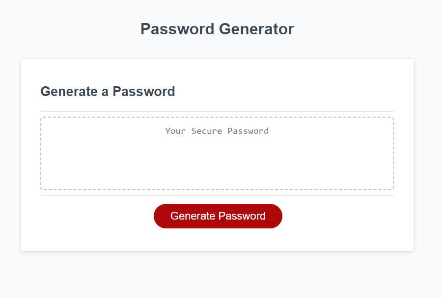

# Homework / Module 03

## Description

This is a simple password generator based on user inputs around password length and inclusion (or exclusion) or certain types of characters. Inputs are validated and mapped to simple numeric and/or boolean values, and a password is generated based on these preferences, and output visually to the webpage.

## Usage

Visit https://obelisk477.github.io/week-03-homework/ and navigate the page as you see fit 

## Credits

* MIT License generated by GitHub

## Screenshot

## License

Please refer to the LICENSE in the repo.